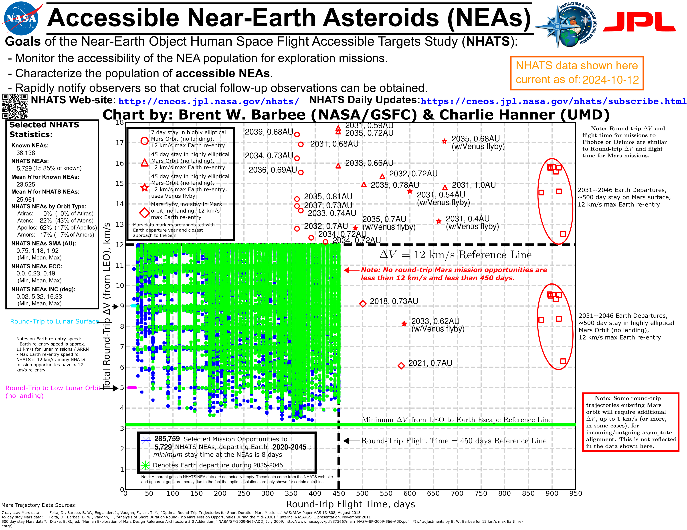

# CNEOS NHATS AsteroidComparison Chart

Author/Maintianer: Charlie Hanner

Please note: The network for this appears to be down for some reason. I will fix it in the next few weeks when I am in the same room as the server again! Please reach out to me if you want me to generate a plot for you! 

This is a repository for public release of the Python code generated for daily-creation of the comparison chart for human-accessible asteroids in the NHATS database. This project was staretd by Brent Barbee of NASA's Goddard Space Flight Center, and was created in Python by myself. The code is released under the CRAPL license (see LICENSE.md for details). I would like to make sure that the code I wrote is publically available, at least for the moment, for fellow engineers and enthusiasts.

The latest image produced is:
 
                                                                                                                                                                                                                                                                                                                                                                                                                               

This code was written in Python 3.10.7, and uses the following libraries:
- requests
- matplotlib
- numpy
- datetime
- PIL
- os
- time
- alive_progress (if running the Demo file - the Silent file does not use this library)

A set of local data files are required as well: 
- PlanetaryData.txt
- The CNEOS Pictures folder contains a few files that are needed for the final image stacking

## Use
You should just be able to run either NHATS_Accessible_NEAs_DEMO.py or NHATS_Accessible_NEAs_Silent.py and it will generate the image. The demo file will show a progress bar and show the final image after it's generated, and the silent file will not. 

The final image will be in the CNEOS Pictures folder, and will be named "NHATS_Accessible_NEAs_YYYY_MM_DD.png" where YYYYMMDD is the date the image was generated.

The code in the subfolder "Daily_Updates" contains a script for automatically adjusting this readme file to include the latest image. This is not required for the code to run, but keeps the main GitHub page up to date with the latest image! It will delete the older files to keep the size of this repository constant (the images are ~2MB).
